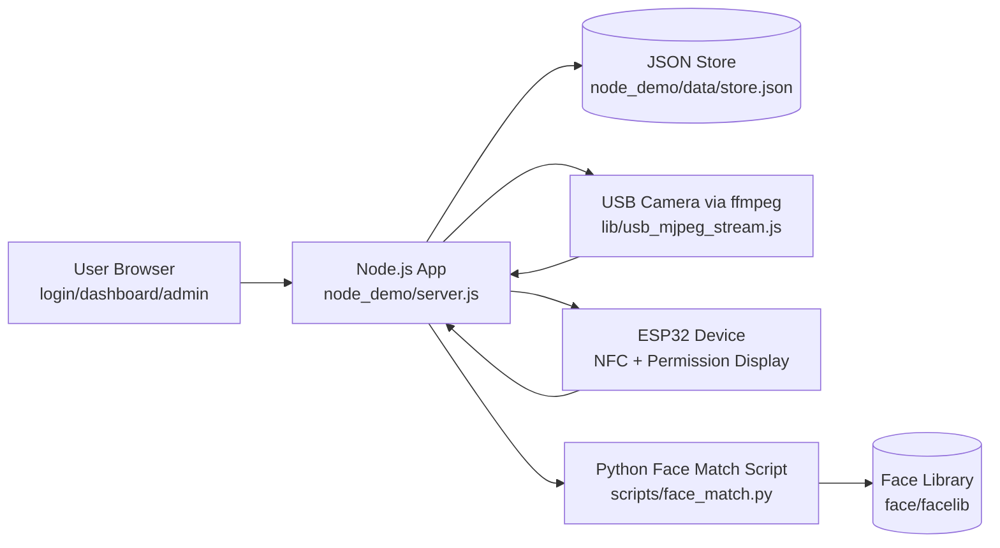
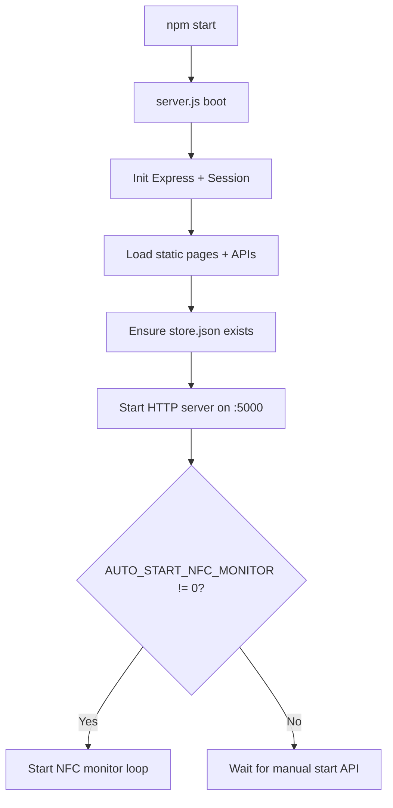
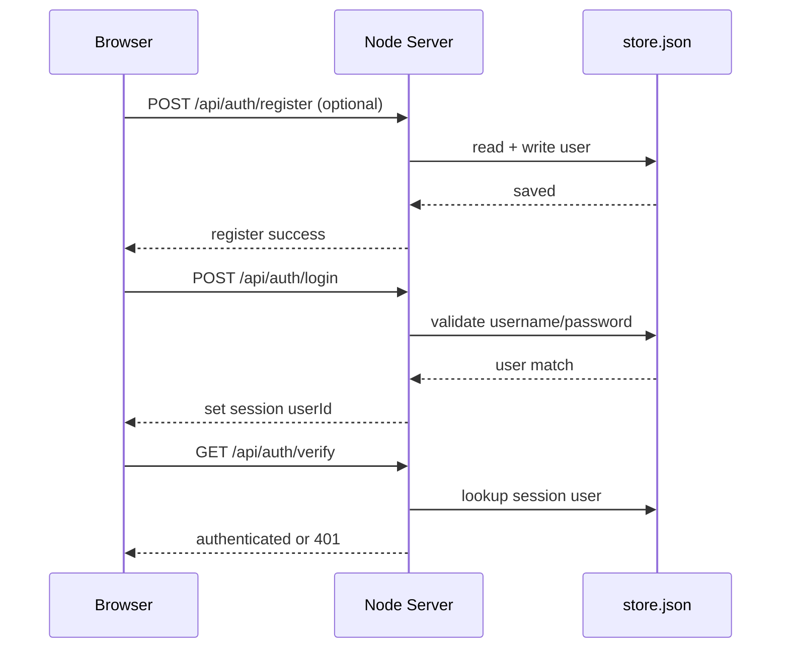
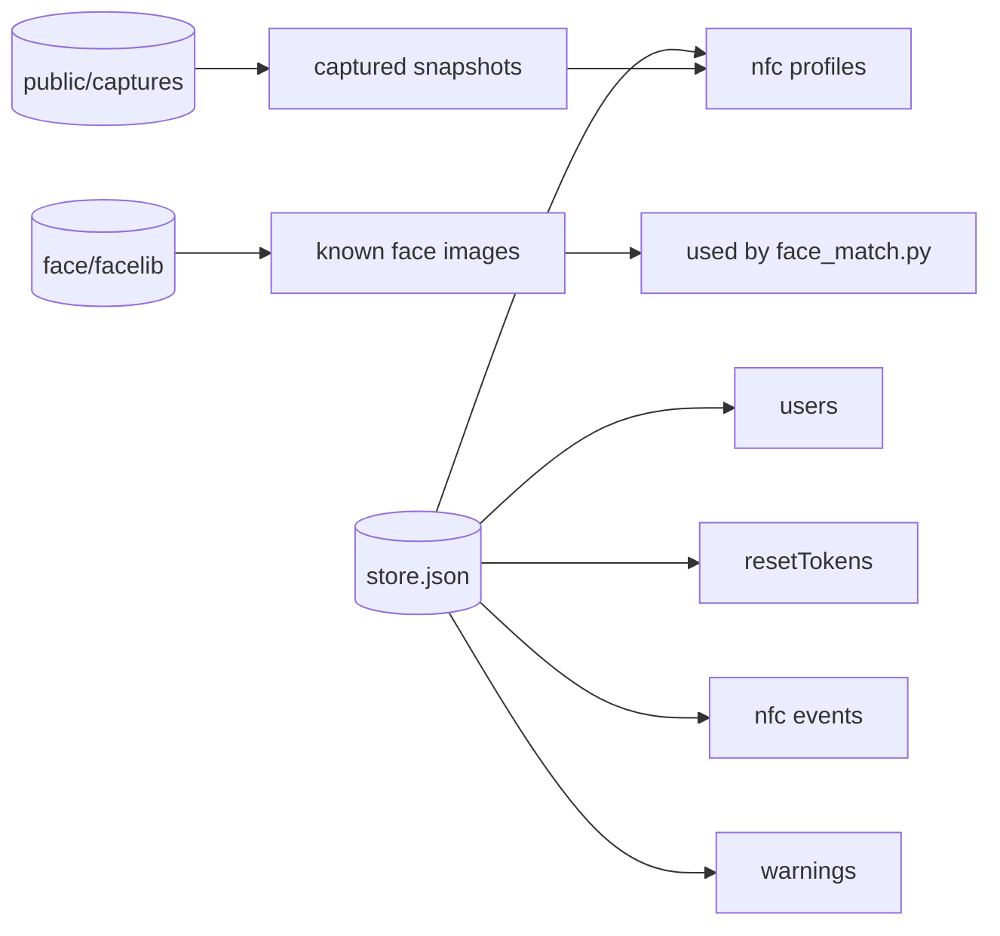

# IBSP Project Flow

This document describes the end-to-end runtime flow of the IBSP demo system using Mermaid diagrams.

## 1) High-Level Architecture



## 2) App Startup and Core Services



## 3) Authentication Flow



## 4) Dashboard Live Stream Flow

```mermaid
flowchart TD
    A[Dashboard loads image /api/stream] --> B{Session valid?}
    B -- No --> C[Return 401]
    B -- Yes --> D[startMjpegChildProcess()]
    D --> E[ffmpeg opens USB camera]
    E --> F[Output multipart MJPEG]
    F --> G[Node pipes stdout to HTTP response]
    G --> H[Browser displays live preview]
    H --> I[On close/abort, kill ffmpeg child]
```

## 5) NFC + Face Verification Decision Flow

```mermaid
flowchart TD
    A[NFC monitor tick] --> B[GET ESP32 /nfc/read]
    B --> C{Card UID received?}
    C -- No --> A
    C -- Yes --> D[processNfcSwipe(card_uid)]
    D --> E[3s countdown to ESP32]
    E --> F[Capture camera frame<br/>or use live frame cache]
    F --> G[Run Python face_match.py]
    G --> H{Decision rules}

    H --> H1[Card registered?]
    H --> H2[Face detected + known?]
    H --> H3[Score >= FACE_ACCEPT_SCORE?]
    H --> H4[Name matches profile?]

    H1 --> I{All checks pass?}
    H2 --> I
    H3 --> I
    H4 --> I

    I -- Yes --> J[Permission = allowed]
    I -- No --> K[Permission = denied + add warning]

    J --> L[Store nfcEvents in JSON]
    K --> L
    L --> M[POST result to ESP32 /nfc/permission-result]
```

## 6) Data Ownership / Persistence



## 7) Main Runtime Entry Points

- UI routes: `/login`, `/dashboard`, `/admin`, `/face-test`
- Auth APIs: `/api/auth/*`
- Stream API: `/api/stream`
- NFC APIs: `/api/nfc/*`, `/api/permitted/register`
- ESP32 status API: `/api/esp32/status`
- Dev APIs: `/api/dev/*`

