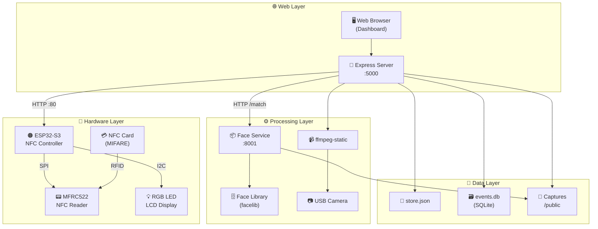
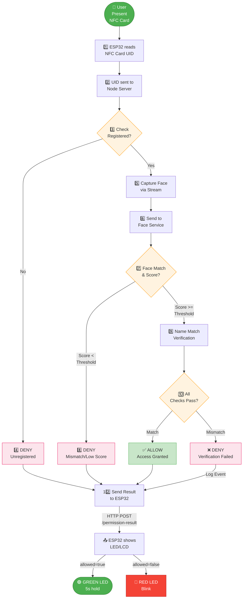
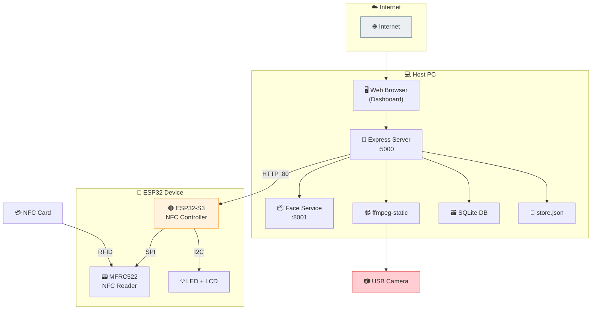

# IBSP - Integrated Biometric Security Platform

This README explains how to run and use the IBSP demo system.

## System Overview

IBSP (Integrated Biometric Security Platform) combines multiple technologies to provide secure access control through NFC card verification and face recognition.

### Architecture

```
┌─────────────────────────────────────────────────────────────────────────────┐
│                           IBSP System Architecture                          │
├─────────────────────────────────────────────────────────────────────────────┤
│                                                                             │
│   ┌──────────────┐         ┌─────────────────┐         ┌─────────────────┐ │
│   │   Browser    │ ──────▶ │  Express Server │ ◀────── │  ESP32-S3       │ │
│   │  (Dashboard) │  HTTP   │    (:5000)      │  HTTP   │  NFC Controller │ │
│   └──────────────┘         └────────┬────────┘         └────────┬────────┘ │
│                                    │                            │          │
│                    ┌───────────────┼───────────────┐            │          │
│                    ▼               ▼               ▼            │          │
│            ┌──────────────┐ ┌──────────────┐ ┌──────────────┐  │          │
│            │ store.json   │ │ events.db    │ │ Face Service │  │          │
│            │  (Profiles)  │ │   (SQLite)   │ │    (:8001)   │  │          │
│            └──────────────┘ └──────────────┘ └──────┬───────┘  │          │
│                                                    │          │          │
│                    ┌──────────────┐                ▼          │          │
│                    │ USB Camera   │ ◀──── ffmpeg (MJPEG)      │          │
│                    └──────────────┘                              │          │
│                                                                             │
│   ┌──────────────┐                            ┌──────────────────────────┐│
│   │  NFC Card    │ ──────────────────────────▶│ MFRC522 / RGB LED / LCD  ││
│   │  (MIFARE)    │        SPI                 └──────────────────────────┘│
│   └──────────────┘                                                            │
└─────────────────────────────────────────────────────────────────────────────┘
```

### Access Decision Flow

```
User Present Card
       │
       ▼
┌──────────────────┐    UID      ┌──────────────────┐
│   ESP32-S3       │◀───────────▶│   Node Server     │
│   NFC Reader     │   HTTP      │                   │
└────────┬─────────┘             └────────┬─────────┘
         │                                 │
         │ UID                              │ Lookup
         ▼                                 ▼
┌──────────────────┐             ┌──────────────────┐
│ Unregistered?    │             │ NFC Profiles      │
│  ────────────   │             │ (store.json)      │
│  YES ──▶ DENY    │             └────────┬─────────┘
│  NO              │                      │
└────────┬─────────┘                      │ Found
         │                                ▼
         │                      ┌──────────────────┐
         │                      │ Capture Face     │
         │                      │ (MJPEG Frame)    │
         │                      └────────┬─────────┘
         │                               │
         │                               │ POST /match
         │                               ▼
         │                      ┌──────────────────┐
         │                      │ Face Service     │
         │                      │ (Recognition)    │
         │                      └────────┬─────────┘
         │                               │
         │                               │ Score + Name
         │                               ▼
         │                      ┌──────────────────┐
         │                      │ Verify Score &  │
         │                      │ Name Match      │
         │                      └────────┬─────────┘
         │                               │
         │                               │ Result
         │                               ▼
         │                      ┌──────────────────┐
         └─────────────────────▶│ POST /permission  │
              HTTP               │ -result          │
                                 └────────┬─────────┘
                                          │
                                          ▼
                                 ┌──────────────────┐
                                 │ ESP32 Response   │
                                 │ GREEN: ALLOW     │
                                 │ RED:   DENY      │
                                 └──────────────────┘
```

### Components

| Component | Technology | Port | Purpose |
|-----------|------------|------|---------|
| Web Dashboard | Express.js + HTML/JS | :5000 | User interface |
| Face Service | FastAPI + PyTorch | :8001 | Face recognition |
| NFC Controller | ESP32-S3 + Arduino | :80 | Card reading & LED/LCD control |
| MJPEG Stream | ffmpeg-static | - | Camera capture |
| Data Storage | SQLite + JSON | - | Events & profiles |

## What this system is

IBSP combines:

- Node.js backend (`node_demo/server.js`)
- Python face service (`node_demo/scripts/face_service.py`)
- ESP32-S3 NFC controller firmware (`ReadAndWrite/ReadAndWrite.ino`)
- USB camera MJPEG stream

Access decision is based on:

1. NFC card
2. Face match score
3. Profile name match

Final decision (`ALLOW` or `DENY`) is sent to ESP32 LED/LCD.

## Project Structure

```
FaceRecognitionNFCmodule/
├── node_demo/                      # Node.js web application
│   ├── server.js                   # Express server (main entry)
│   ├── package.json                # Node dependencies
│   ├── public/                     # Static files
│   │   ├── dashboard.html         # Main dashboard UI
│   │   ├── dashboard.js           # Dashboard JavaScript
│   │   ├── styles.css            # Dashboard styles
│   │   ├── login.html            # Login page
│   │   └── captures/             # Captured images
│   ├── scripts/
│   │   ├── face_service.py       # Python face recognition service
│   │   ├── start_face_service.ps1 # Windows launcher
│   │   ├── start_face_service.cmd
│   │   └── start_face_service.sh
│   ├── lib/                       # Internal modules
│   │   ├── usb_mjpeg_stream.js   # MJPEG streaming
│   │   ├── detect_windows_camera.js
│   │   └── persistence.js        # SQLite persistence
│   └── data/
│       ├── store.json            # User & NFC profiles
│       └── events.db             # SQLite events database
│
├── ReadAndWrite/
│   └── ReadAndWrite.ino          # ESP32-S3 NFC controller firmware
│
├── face/                          # Face recognition models
│   ├── face_api.py               # Face recognition API
│   └── facelib/                  # Known faces database
│
├── docs/
│   └── diagrams/                  # D2 diagram source files
│       ├── system_architecture.d2
│       ├── data_flow.d2
│       └── network_topology.d2
│
├── requirements.txt               # Python dependencies
└── README.md                      # This file
```

## Access Decision Logic

Access is granted based on three verification steps:

1. **NFC Card Verification**
   - Card UID must be registered in the system
   - Unregistered cards are immediately denied

2. **Face Match Score**
   - Captured face image is compared against registered face
   - Score must meet or exceed the configured threshold (default: 0.85)
   - Configurable via Settings tab (0.10 - 0.99)

3. **Profile Name Match**
   - Recognized face name must match the registered person's name
   - Case-insensitive comparison

**Final Decision**:
- `ALLOW` → Green LED (5 seconds), then monitor pause (3 seconds)
- `DENY` → Red LED (blinking)

## Prerequisites

| Software | Version | Purpose |
|----------|---------|---------|
| Node.js | 18+ recommended | Backend server runtime |
| Python | 3.10+ | Face recognition service |
| Arduino IDE | Latest | ESP32 firmware development |
| ffmpeg | Bundled (ffmpeg-static) | MJPEG stream processing |

### Hardware

- USB camera connected to host PC
- ESP32-S3 connected to same WiFi network as PC
- MIFARE Classic NFC cards/tags
- MFRC522 NFC reader module

## 1) Install dependencies

### Node dependencies

```bash
cd node_demo
npm install
```

### Python dependencies

From project root:

```bash
pip install -r requirements.txt
```

Or from `node_demo`, launcher scripts auto-install missing `fastapi/uvicorn`.

## 2) Flash ESP32 firmware

Open:

- `ReadAndWrite/ReadAndWrite.ino`

Then:

1. Select your ESP32-S3 board and COM port.
2. Upload firmware.
3. Open Serial Monitor at `115200`.

Notes:

- Some Arduino library warnings are normal.
- If multiple-library conflicts appear, prefer ESP32 core libraries over duplicates in `Documents/Arduino/libraries`.

## 3) Start services

Open terminal #1 (`node_demo`):

```bash
npm run face:service:window:ps
```

If PowerShell launcher is problematic on your machine:

```bash
npm run face:service:window:cmd
```

Open terminal #2 (`node_demo`):

```bash
npm start
```

## 4) Open dashboard

Go to:

- `http://localhost:5000`

Login and open `/dashboard`.

## 5) How to use (normal flow)

### A. Register profile (NFC + face)

In dashboard:

1. Go to **Enroll** tab.
2. Fill person fields.
3. Click **Read Card & Enroll**.
4. Present NFC card when prompted.

The system stores:

- NFC profile in store
- Face image in face library

### B. Start access monitor

In **NFC** tab:

1. Click **Start Background Monitor**.
2. Present card to test.

During verification:

- Stream center overlay shows countdown / matching status.
- ESP32 remains in pending state while matching.

Final behavior:

- `ALLOW` -> green LED (5 seconds), then monitor pause (3 seconds)
- `DENY` -> red LED

### C. Tune confidence threshold

In **Settings** tab:

1. Set **Face Threshold** (`0.10` to `0.99`)
2. Click **Save Threshold**

Higher threshold = stricter matching.

## 6) Important runtime behavior

- Face service stays in memory (no per-swipe model cold start)
- `/api/stream` uses shared ffmpeg process (single camera pipeline for multi-clients)
- `nfcEvents` and `warnings` append to SQLite (`node_demo/data/events.db`)
- `store.json` uses atomic write for profile/auth-type data

## 7) Common troubleshooting

- `reason=no_stream_frame`:
  - Ensure dashboard stream is active
  - Keep page open so frame cache updates
- Face service not starting:
  - Use `npm run face:service:window:cmd`
  - Verify `python -m pip show uvicorn`
- ESP32 shows wrong LED timing:
  - Reflash latest `ReadAndWrite.ino`
- Repeated scans too fast:
  - ALLOW path already includes 3-second scan pause

## 8) System Diagrams

View diagrams in Mermaid format by clicking the links below:

- [System Architecture Diagram](docs/diagrams/system_architecture.md) | [SVG](docs/diagrams/system_architecture.svg) | [D2 Source](docs/diagrams/system_architecture.d2)
- [Data Flow Diagram](docs/diagrams/data_flow.md) | [SVG](docs/diagrams/data_flow.svg) | [D2 Source](docs/diagrams/data_flow.d2)
- [Network Topology Diagram](docs/diagrams/network_topology.md) | [SVG](docs/diagrams/network_topology.svg) | [D2 Source](docs/diagrams/network_topology.d2)

### System Architecture



### Data Flow



### Network Topology



## 9) Useful Endpoints

- Health: `GET /api/health`
- Face threshold:
  - `GET /api/face/settings`
  - `POST /api/face/settings`
- NFC monitor:
  - `POST /api/nfc/monitor/start`
  - `POST /api/nfc/monitor/stop`
  - `GET /api/nfc/monitor/status`

