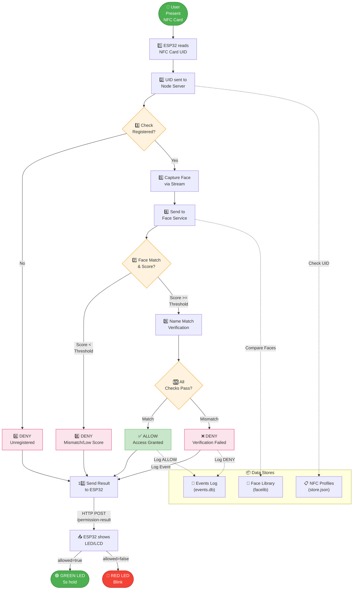

# Data Flow Diagram
# IBSP Access Verification Flow

```mermaid
flowchart TD
    START(["👤 User<br/>Present<br/>NFC Card"]) --> STEP1
    STEP1["1️⃣ ESP32 reads<br/>NFC Card UID"] --> STEP2
    STEP2["2️⃣ UID sent to<br/>Node Server"] --> STEP3
    STEP3{"3️⃣ Check<br/>Registered?"}

    STEP3 -->|"No"| STEP4["4️⃣ DENY<br/>Unregistered"]
    STEP3 -->|"Yes"| STEP5["5️⃣ Capture Face<br/>via Stream"]
    STEP4 --> STEP13["12️⃣ Send Result<br/>to ESP32"]
    STEP5 --> STEP6["6️⃣ Send to<br/>Face Service"]
    STEP6 --> STEP7{"7️⃣ Face Match<br/>& Score?"}

    STEP7 -->|"Score <<br/>Threshold"| STEP8["8️⃣ DENY<br/>Mismatch/Low Score"]
    STEP7 -->|"Score >=<br/>Threshold"| STEP9["9️⃣ Name Match<br/>Verification"]
    STEP8 --> STEP13
    STEP9 --> STEP10{"🔟 All<br/>Checks Pass?"}

    STEP10 -->|"Match"| STEP11["✅ ALLOW<br/>Access Granted"]
    STEP10 -->|"Mismatch"| STEP12["❌ DENY<br/>Verification Failed"]
    STEP11 --> STEP13
    STEP12 -->|"Log Event"| STEP13
    STEP13 -->|"HTTP POST<br/>/permission-result"| STEP14["📤 ESP32 shows<br/>LED/LCD"]
    STEP14 -->|"allowed=true"| END_ALLOW(["🟢 GREEN LED<br/>5s hold"])
    STEP14 -->|"allowed=false"| END_DENY(["🔴 RED LED<br/>Blink"])

    subgraph DataStores["📦 Data Stores"]
        NFC_Profiles["📋 NFC Profiles<br/>(store.json)"]
        Face_Library["👥 Face Library<br/>(facelib)"]
        Events_Log["📝 Events Log<br/>(events.db)"]
    end

    STEP2 -.->|"Check UID"| NFC_Profiles
    STEP6 -.->|"Compare Faces"| Face_Library
    STEP11 -.->|"Log ALLOW"| Events_Log
    STEP12 -.->|"Log DENY"| Events_Log

    style START fill:#4caf50,stroke:#2e7d32,color:#fff
    style END_ALLOW fill:#4caf50,stroke:#2e7d32,color:#fff
    style END_DENY fill:#f44336,stroke:#b71c1c,color:#fff
    style STEP3 fill:#fff3e0,stroke:#ff9800
    style STEP7 fill:#fff3e0,stroke:#ff9800
    style STEP10 fill:#fff3e0,stroke:#ff9800
    style STEP4 fill:#fce4ec,stroke:#e91e63
    style STEP8 fill:#fce4ec,stroke:#e91e63
    style STEP12 fill:#fce4ec,stroke:#e91e63
    style STEP11 fill:#c8e6c9,stroke:#4caf50
```
