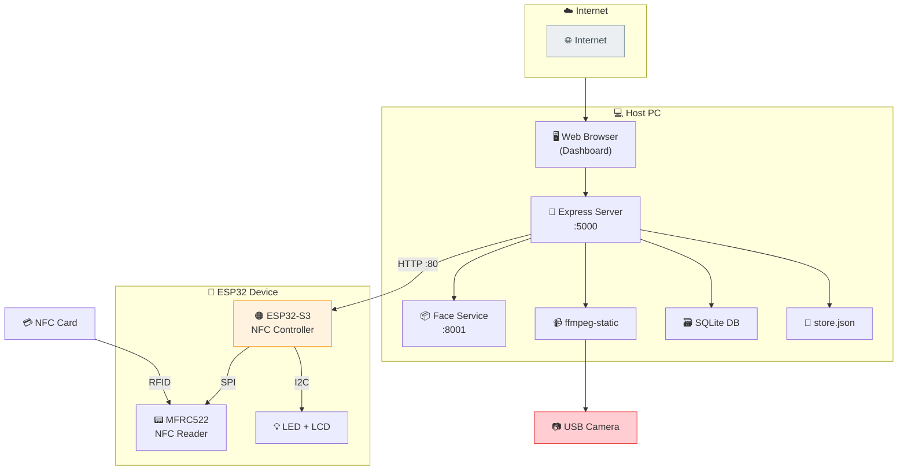

# Network Topology Diagram
# IBSP Network Architecture

```mermaid
flowchart TB
    subgraph Internet["☁️ Internet"]
        INTERNET["🌐 Internet"]
    end

    subgraph HostPC["💻 Host PC"]
        Browser["🖥️ Web Browser<br/>(Dashboard)"]
        Node_Server["🔷 Express Server<br/>:5000"]
        Face_Service["📦 Face Service<br/>:8001"]
        FFmpeg["📹 ffmpeg-static"]
        SQLite["🗃️ SQLite DB"]
        Store_JSON["📄 store.json"]
    end

    subgraph ESP32Device["🔌 ESP32 Device"]
        ESP32["🟠 ESP32-S3<br/>NFC Controller"]
        NFC_Reader["📟 MFRC522<br/>NFC Reader"]
        LED_LCD["💡 LED + LCD"]
    end

    CAMERA["📷 USB Camera"]
    NFC_CARD["💳 NFC Card"]

    Internet --> Browser
    Browser --> Node_Server
    Node_Server --> Face_Service
    Node_Server --> FFmpeg
    FFmpeg --> CAMERA
    Node_Server --> SQLite
    Node_Server --> Store_JSON
    Node_Server -->|"HTTP :80"| ESP32
    ESP32 -->|"SPI"| NFC_Reader
    ESP32 -->|"I2C"| LED_LCD
    NFC_CARD -->|"RFID"| NFC_Reader

    style INTERNET fill:#eceff1,stroke:#78909c,color:#37474f
    style ESP32 fill:#fff3e0,stroke:#fb8c00
    style CAMERA fill:#ffcdd2,stroke:#e53935
```
