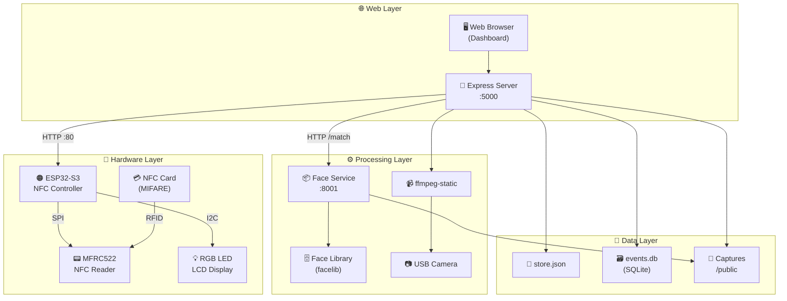

# System Architecture Diagram
# IBSP - Integrated Biometric Security Platform

```mermaid
flowchart TB
    subgraph Web["🌐 Web Layer"]
        Browser["🖥️ Web Browser<br/>(Dashboard)"]
        Dashboard_Server["🔷 Express Server<br/>:5000"]
    end

    subgraph Processing["⚙️ Processing Layer"]
        Face_Service["📦 Face Service<br/>:8001"]
        Face_DB["🗄️ Face Library<br/>(facelib)"]
        Stream_Service["📹 ffmpeg-static"]
        USB_Camera["📷 USB Camera"]
    end

    subgraph Hardware["🔌 Hardware Layer"]
        ESP32["🟠 ESP32-S3<br/>NFC Controller"]
        NFC_Reader["📟 MFRC522<br/>NFC Reader"]
        LED_LCD["💡 RGB LED<br/>LCD Display"]
        NFC_Card["💳 NFC Card<br/>(MIFARE)"]
    end

    subgraph Data["💾 Data Layer"]
        Store_JSON["📄 store.json"]
        Events_DB["🗃️ events.db<br/>(SQLite)"]
        Captures["📁 Captures<br/>/public"]
    end

    Browser --> Dashboard_Server
    Dashboard_Server -->|"HTTP /match"| Face_Service
    Face_Service --> Face_DB
    Dashboard_Server --> Stream_Service
    Stream_Service --> USB_Camera
    Dashboard_Server -->|"HTTP :80"| ESP32
    ESP32 -->|"SPI"| NFC_Reader
    ESP32 -->|"I2C"| LED_LCD
    NFC_Card -->|"RFID"| NFC_Reader
    Dashboard_Server --> Store_JSON
    Dashboard_Server --> Events_DB
    Dashboard_Server --> Captures
    Face_Service --> Captures
```
